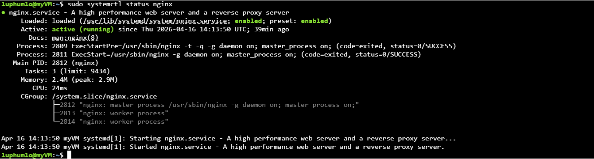

# azure-nginx-multi-site
Deployed an Azure VM and configured Nginx to host multiple sites using URL routing 
# Azure Nginx Multi-Site Routing Project

* Overview
This project demonstrates how I deployed an Ubuntu Linux virtual machine in Microsoft Azure, installed Nginx, and configured it to serve two separate websites from a single server using URL-based routing.
📸 Screenshots
## 📸 Screenshots

### Nginx Running



### Nginx Config Enabled


### Nginx Config File


### Sites Running


### Site 1 Code


### Site 2 Code


* What I built
- Created an Ubuntu VM in Microsoft Azure
- Connected securely using SSH
- Installed and verified Nginx
- Opened and configured networking rules for SSH and HTTP
- Created two separate website directories:
  - `/var/www/site1`
  - `/var/www/site2`
- Added custom HTML pages for each site
- Configured Nginx to route:
  - `/site1/` to Site 1
  - `/site2/` to Site 2

* Technologies used
- Microsoft Azure
- Ubuntu Linux
- Nginx
- SSH
- HTML
- Networking / NSG rules

*Nginx configuration used
```nginx
server {
    listen 80;
    server_name _;

    location /site1/ {
        alias /var/www/site1/;
        index index.html;
    }

    location /site2/ {
        alias /var/www/site2/;
        index index.html;
    }
}
